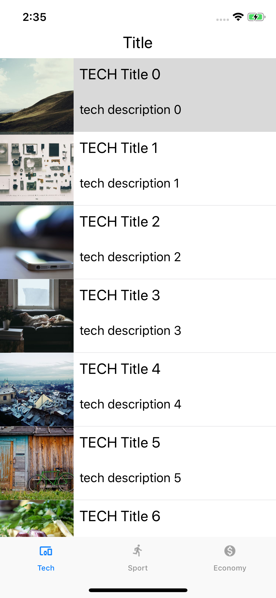
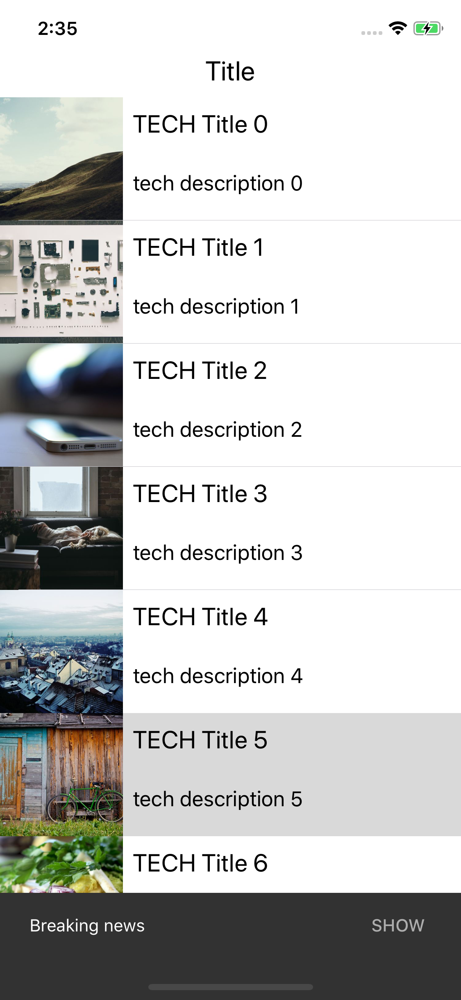

# gRPC News iOS client

## Overview 

  

## Build & Run Project

Use Xcode 10 and cocoapod to build application:

```SH
pod install
open ios.xcworkspace
```

## Libraries used

* [gRPC Swift](https://github.com/grpc/grpc-swift)
* [MaterialComponents (SnackBar)](https://material.io/develop/ios/components/snackbars/)
