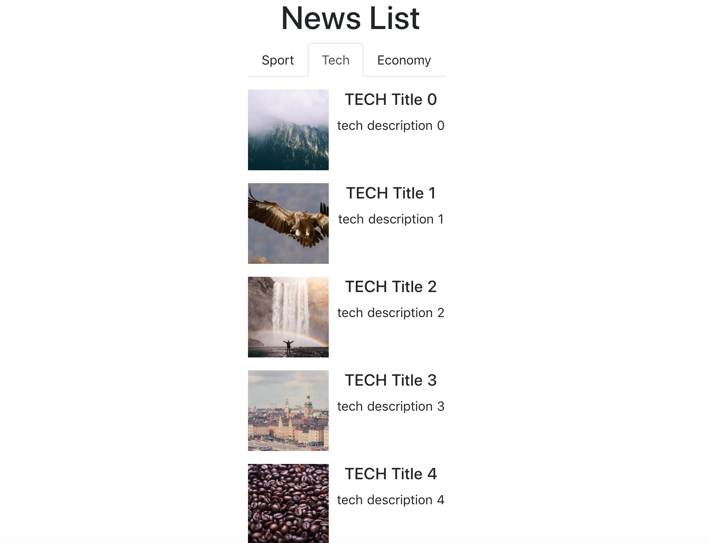
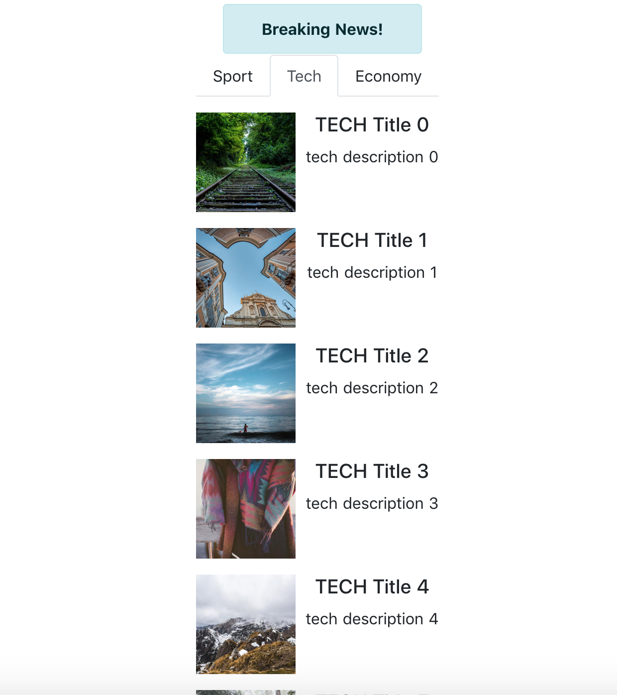

# news-webapp

   


> News webapp with grpc-web


## Build and Run

``` bash
# install dependencies
$ npm install

# serve with hot reload at localhost:3000
$ npm run dev

# build for production and launch server
$ npm run build
$ npm start

# generate static project
$ npm run generate
```

For detailed explanation on how things work, checkout [Nuxt.js docs](https://nuxtjs.org).

## Used Stack
* [NuxtJS](https://nuxtjs.org/)
* [Bootstrap-Vue](https://bootstrap-vue.js.org/)
* [grpc-web](https://github.com/grpc/grpc-web)
* [grpc-web-middleware](https://github.com/fb64/grpc-web-middleware)
